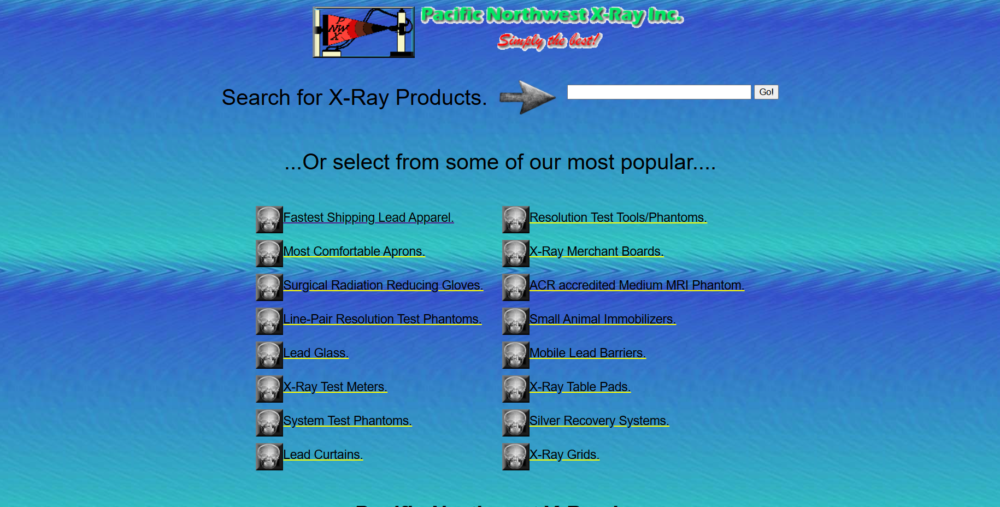

# 🩻 Pacific Northwest X-Ray Inc. (PNWX) — Avaliação de UX & Usabilidade

> Repositório do Trabalho Prático de IHC: inspeção heurística, testes de usabilidade, UEQ e Avaliação de Comunicabilidade (MAC).

---

## 📚 Sumário
- [1. Descrição do Sistema](#-1-descrição-do-sistema--pacific-northwest-x-ray-inc-pnwx)
- [2. Inspeção de Usabilidade](#-2-inspeção-de-usabilidade--pacific-northwest-x-ray-inc-pnwx)
- [3. Teste de Usabilidade](#-3-teste-de-usabilidade)
- [4. Avaliação de UX (UEQ)](#-4-avaliação-de-ux-ueq)
- [5. Avaliação de Comunicabilidade (MAC)](#-5-avaliação-de-comunicabilidade)
- [📂 Estrutura do Repositório](#-estrutura-do-repositório)
- [▶️ Como visualizar os resultados](#️-como-visualizar-os-resultados)
- [👥 Equipe](#-equipe)

---

# 🩻 1. Descrição do Sistema – Pacific Northwest X-Ray Inc. (PNWX)

## 🏷️ Domínio do Sistema
O **PNWX** pertence ao domínio de **e-commerce especializado em saúde**, com foco na venda e distribuição global de equipamentos, peças, acessórios e suprimentos de **radiologia e diagnóstico por imagem**.

## 💻 Contexto de Uso
A plataforma funciona como **site web** (desktop/tablet) e possui **responsividade parcial em mobile**.

**Ambientes típicos:**
- 🏥 Hospitais e clínicas  
- 🧪 Laboratórios e centros de diagnóstico por imagem  
- 🩺 Profissionais autônomos e técnicos radiologistas  

**Premissas e restrições:**
- 🌐 Necessita de internet  
- 🔤 Idioma principal: **inglês**  
- 🛒 **Sem carrinho**: aquisição via **solicitação de orçamento**

## 🎯 Objetivo do Sistema
Facilitar a **aquisição de equipamentos de radiologia**: localizar/consultar produtos, solicitar orçamento e contatar suporte técnico.

## 👤 Usuários-alvo

| Usuário                           | Nível             | Objetivos principais                                                      |
|----------------------------------|-------------------|---------------------------------------------------------------------------|
| Instituições de saúde            | Intermediário/Avançado | Equipar clínicas com máquinas e acessórios de radiologia.          |
| Laboratórios/centros de imagem   | Intermediário     | Comprar equipamentos técnicos e peças de reposição.                      |
| Profissionais autônomos/técnicos | Iniciante/Intermediário | Adquirir EPIs, ferramentas portáteis e insumos.                    |

## 📋 Tarefas Principais
1) Pesquisar/filtrar produtos • 2) Consultar especificações • 3) Solicitar orçamento • 4) Contatar suporte

## 🖼️ Imagem Representativa
  
> **Figura 1 – Home do site PNWX.**

🔗 **Site oficial**: https://www.pnwx.com

---

# 🔎 2. Inspeção de Usabilidade – Pacific Northwest X-Ray Inc. (PNWX)

Avaliação com as **10 Heurísticas de Nielsen**:
1) Detecção individual → 2) Consolidação → 3) Discriminação (defeito x falso-positivo) → 4) Lista limpa.

🔗 Evidências (prints/tabelas) no **Notion**:  
[Inspeção de Usabilidade — Notion](https://spiky-fact-32a.notion.site/Inspe-o-de-Usabilidade-26ea7e3beb4381e4a5ace94a783b9d44)

### ✅ Coleção Consolidada (C-01 … C-11)
Problemas recorrentes: **busca sem autocomplete**, **layout confuso/sem breadcrumbs**, **listas longas e sem hierarquia**, **páginas de produto pouco escaneáveis**, **links de e-mail quebrados**, **ausência de suporte a erros**, **sem carrinho/checkout**, **sem reviews**.

### ✅ Lista Limpa (L-01 … L-11)
Recomendações-chave:
- Autocomplete na busca, breadcrumbs e menus claros  
- Melhorar contraste/organização e **incluir filtros/carrinho**  
- **Mensagens de erro/feedback** e **FAQ**  
- Botão “voltar”, **checkout** e **avaliações de usuários**

---

# 🧪 3. Teste de Usabilidade

**8 participantes**, **10 tarefas**. Métricas: **sucesso/ajuda/falha**, **tempo médio**, **observações**.  
📁 Resultados individuais em: `./Testes-Usuários/`

### 📊 Consolidação (T1–T10)
| Tarefa | Sucesso | Ajuda | Falha | Tempo | Observações |
|---|---:|---:|---:|---:|---|
| T1 | 7/8 | 1/8 | 0/8 | ~20s | Contato no rodapé (fácil) |
| T2 | 5/8 | 2/8 | 1/8 | ~1m20s | Poluição visual |
| T3 | 8/8 | 0/8 | 0/8 | ~30s | OK |
| T4 | 8/8 | 0/8 | 0/8 | ~50s | Erros antes de localizar |
| T5 | 6/8 | 1/8 | 1/8 | ~1m10s | Menus confusos |
| T6 | 4/8 | 3/8 | 1/8 | ~2m10s | **Mais crítica**, excesso de texto |
| T7 | 7/8 | 1/8 | 0/8 | ~1m40s | Muitas opções confusas |
| T8 | 6/8 | 1/8 | 1/8 | ~1m40s | Vários erros |
| T9 | 6/8 | 1/8 | 1/8 | ~1m00s | Políticas de envio escondidas |
| T10| 0/8 | 2/8 | 6/8 | ~1m20s | **Falha crítica**: e-mail indisponível |

### 🧮 SUS (0–100)
| P1 | P2 | P3 | P4 | P5 | P6 | P7 | P8 | **Média** |
|---:|---:|---:|---:|---:|---:|---:|---:|---:|
| 17,5 | 30,0 | 37,5 | 25,0 | 25,0 | 22,5 | 17,5 | 32,5 | **26,9** |

> **Muito abaixo de 70 → péssima usabilidade.**

---

# 🎨 4. Avaliação de UX (UEQ)

**Questionário UEQ** aplicado aos 8 participantes.  
Gráficos e benchmark na pasta `Imagens/User Experience Questionnaire/UEQ/`.

## 📊 Gráficos e Benchmark
  
> **Figura 2 – Perfil consolidado das 6 dimensões do UEQ.**

  
> **Figura 3 – Médias comparadas ao benchmark UEQ.**  
Linhas de referência: **+1 (aceitável)**, **0 (neutro)**, **−1 (ruim)**.

## 🧩 Interpretação Contextualizada
- **Atratividade**: baixa — estética e interação desagradam.  
- **Clareza (Perspicuidade)**: baixa — navegação/rótulos confusos.  
- **Eficiência**: baixa — pouco prático, fluxos longos.  
- **Confiabilidade (Dependabilidade)**: baixa — erros e pouco feedback.  
- **Estímulo**: baixa — experiência desmotivadora.  
- **Novidade (Inovação)**: baixa — visual antiquado.

## 📂 Planilhas/Imagens UEQ
Arquivos individuais em `Imagens/User Experience Questionnaire (UEQ)/`:
`AnaPaula_UEQ.jpg`, `BeneditaMarroca_UEQ.jpg`, `Joao_UEQ.jpg`, `Josiel_UEQ.jpg`,
`Maria_UEQ.jpg`, `Mildo_UEQ.jpg`, `SabrinaLeal_UEQ.jpg`, `Wamberson_UEQ.jpg`.

## ✅ Conclusão (UEQ)
- **Positivo**: poucas funcionalidades técnicas foram concluídas com esforço.  
- **Negativo**: **clareza**, **eficiência** e **estímulo** muito baixos; **links quebrados/feedback fraco**.  
- **Correlação**: dificuldades do UEQ batem com tarefas críticas do teste (T2, T4, T6, **T10**).

---

# 🗣️ 5. Avaliação de Comunicabilidade
Aplicação das **etiquetas MAC** (Clarisse de Souza) em dois usuários (exemplos completos no relatório):

- Etiquetas mais frequentes: **Cadê?** e **E agora?** (12 ocorrências cada).  
- U1 apresentou maior variedade de etiquetas (8 tipos).  
- U2 concentrou dificuldades em **localização** e **conclusão de tarefas**.

Tabelas completas em `Testes-Usuários/` (seções MAC).

---
