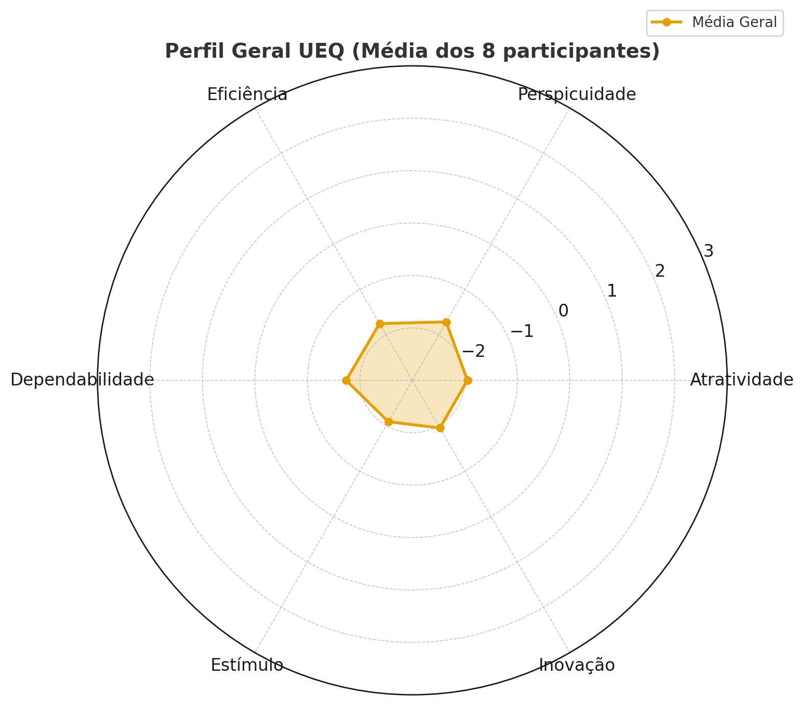

# 🎨 4. Avaliação de UX (UEQ)

## 🎯 Introdução
Após a execução dos testes de usabilidade, aplicou-se o **User Experience Questionnaire (UEQ)** com os mesmos 8 participantes.  
O objetivo foi captar a **percepção subjetiva da experiência de uso**, considerando dimensões como atratividade, clareza, eficiência, confiabilidade, estímulo e novidade.

Os resultados foram consolidados em **gráficos** e comparados com o **benchmark oficial do UEQ**.  

---

## 📊 Gráficos e Benchmark

### ✅ Gráfico Geral Consolidado

> **Figura 2 – Perfil consolidado das 6 dimensões do UEQ.**

- Mostra a **média dos participantes (P1–P8)** em cada escala do questionário.  
- É possível observar que todas as dimensões ficaram **abaixo do ponto neutro (0)**, indicando percepção negativa do sistema.  

---

### 📈 Benchmark por Dimensão

> **Figura 3 – Comparação das médias do sistema com o benchmark internacional do UEQ.**

- As **linhas de referência** indicam a escala de classificação:  
  - **> +1,0** → considerado **bom/muito bom**.  
  - **entre -0,8 e +0,8** → considerado **médio/aceitável**.  
  - **< -0,8** → considerado **ruim/muito ruim**.  
- Neste estudo, todas as dimensões ficaram na faixa de **ruim/muito ruim**, reforçando os problemas de usabilidade.  

---

## 🧩 Interpretação Contextualizada

- **Atratividade**: Os usuários consideraram o sistema pouco atrativo, com relatos de **frustração e insatisfação**, reforçando a baixa aceitação geral.  
- **Clareza**: Houve forte percepção de **confusão visual e dificuldade de navegação**. Muitos não souberam diferenciar botões de textos, o que indica problemas sérios de clareza.  
- **Eficiência**: A experiência foi considerada **ineficiente e burocrática**. As tarefas exigiram esforço extra e tempo elevado, com falhas frequentes na execução.  
- **Confiabilidade**: O sistema **não transmitiu segurança**; links quebrados, ausência de feedback e mensagens de erro dificultaram a confiança do usuário.  
- **Estímulo**: Em vez de motivador, o sistema foi percebido como **desinteressante e cansativo**, sem engajamento positivo durante as interações.  
- **Novidade**: O design foi avaliado como **antiquado e pouco inovador**, não trazendo sensação de modernidade ou diferenciação em relação a outros sistemas.  

---

## 📂 Planilhas UEQ
Os resultados detalhados de cada participante estão disponíveis na pasta:  
[User Experience Questionnaire (UEQ)](../Imagens/UserExperienceQuestionnaireUEQ).

- João Vitor – `Joao_UEQ.jpg`  
- Mildo Castro – `Mildo_UEQ.jpg`  
- Josiel Santos – `Josiel_UEQ.jpg`  
- Ana Paula – `AnaPaula_UEQ.jpg`  
- Benedita Marroca – `BeneditaMarroca_UEQ.jpg`  
- Wamberson Pacheco – `Wamberson_UEQ.jpg`  
- Sabrina Leal – `SabrinaLeal_UEQ.jpg`  
- Maria Vitória – `Maria_UEQ.jpg`  

---

## ✅ Conclusão
O UEQ reforça os achados do teste de usabilidade, indicando que:

- **Pontos positivos**: Poucos aspectos foram percebidos de forma razoável, como a presença de algumas funcionalidades técnicas úteis e a possibilidade de concluir certas tarefas após esforço.  
- **Pontos negativos**: Predominaram críticas em relação à **baixa clareza visual**, **ineficiência no fluxo de navegação**, **falta de confiabilidade** (links quebrados e ausência de feedback), além de uma **experiência pouco atrativa e desmotivadora**.  
- **Correlação com tarefas críticas**: As maiores dificuldades do UEQ se alinham às tarefas mais problemáticas no teste de usabilidade, especialmente em **buscar informações relevantes (T2, T4)** e **realizar ações críticas como envio de e-mail ou finalizar processos (T6, T10)**.  

Em conjunto, os resultados confirmam que o sistema **possui falhas severas de usabilidade e experiência**, principalmente em **eficiência, clareza e estímulo**, o que compromete a satisfação geral dos usuários.  

