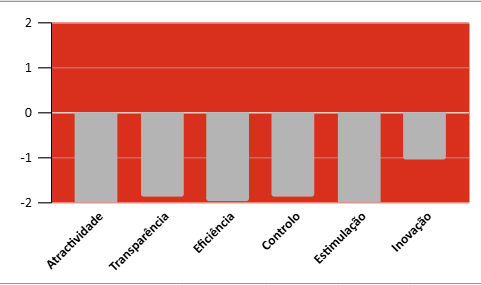
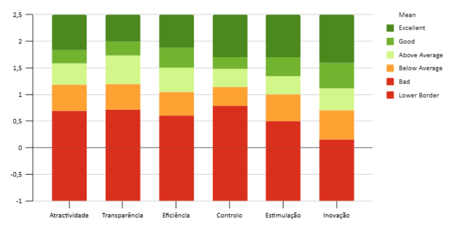
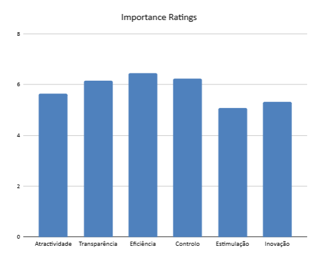

# 🎨 4. Avaliação de UX (UEQ)

## 🎯 Introdução
Após a execução dos testes de usabilidade, aplicou-se o **User Experience Questionnaire (UEQ)** com os mesmos 8 participantes.  
O objetivo foi captar a **percepção subjetiva da experiência de uso**, considerando dimensões como atratividade, clareza, eficiência, confiabilidade, estímulo e novidade.

Os resultados foram consolidados em **gráficos** e comparados com o **benchmark oficial do UEQ**.  

---

## 📊 Gráficos e Benchmark

### ✅ Gráfico Geral 

> **Figura 2 – Perfil consolidado das 6 dimensões do UEQ.**

- O gráfico mostra que, em relação à meta (barras vermelhas), todos os critérios avaliados estão com um desempenho negativo (barras cinzas). A Inovação é a área com o resultado menos negativo (cerca de -1), enquanto as outras cinco áreas apresentam um desempenho significativamente pior (próximo de -2).

---

### 📈 Benchmark por Dimensão

> **Figura 3 – Comparação das médias do sistema com o benchmark internacional do UEQ.**

- As **linhas de referência** indicam a escala de classificação:  
  - **> +1,0** → considerado **bom/muito bom**.  
  - **entre -0,8 e +0,8** → considerado **médio/aceitável**.  
  - **< -0,8** → considerado **ruim/muito ruim**.  
- Neste estudo, todas as dimensões ficaram na faixa de **ruim/muito ruim**, reforçando os problemas de usabilidade.  

### 📊 Gráfico Avaliações de Importância

> **Figura 4 – Comparação das Avaliações consideradas as mais importantes.**
- Esse gráfico classifica a importância de cada uma dessas áreas em uma escala de 0 a 8.
- Mais Importantes: Eficiência, Transparência e Controlo são vistas como as áreas mais críticas para o sucesso.
- Menos Importantes: Estimulação e Inovação foram classificadas como as de menor importância relativa.

---

## 🧩 Interpretação Contextualizada

- **Atratividade**: Classificada como "Ruim" no benchmark, refletindo a frustração e a baixa aceitação geral relatada pelos usuários.
- **Transparência**: Também avaliada como "Ruim", o que valida a percepção de confusão visual e dificuldade de navegação no sistema.
- **Eficiência**: A nota "Ruim" confirma que a experiência foi ineficiente, exigindo esforço e tempo elevados para realizar as tarefas.
- **Controlo**: A classificação "Ruim" reforça que o sistema não transmitiu segurança ou confiabilidade, minando a confiança do usuário.
- **Estimulação**: Avaliada como "Ruim", a interação foi percebida como desinteressante e cansativa, sem gerar engajamento.
- **Inovação**: Ficou na pior faixa de classificação ("Muito Ruim" / "Lower Border"), confirmando a percepção de um design antiquado e pouco moderno.

---

## 📂 Planilhas UEQ
Os resultados detalhados de cada participante estão disponíveis na pasta:  
[User Experience Questionnaire (UEQ)](../Imagens/UserExperienceQuestionnaireUEQ).

- João Vitor – `P1_Joao_UEQ.jpg`  
- Mildo Castro – `P2_Mildo_UEQ.jpg`  
- Josiel Santos – `P3Josiel_UEQ.jpg`  
- Ana Paula – `P4_AnaPaula_UEQ.jpg`  
- Benedita Marroca – `P5_BeneditaMarroca_UEQ.jpg`  
- Wamberson Pacheco – `P6_Wamberson_UEQ.jpg`  
- Sabrina Leal – `P7_SabrinaLeal_UEQ.jpg`  
- Maria Vitória – `P8_Maria_UEQ.jpg`  

---

## ✅ Conclusão
O benchmark do UEQ quantifica os problemas de usabilidade, indicando que:

- **Pontos positivos**: Nenhum aspecto foi avaliado positivamente. Todas as dimensões do sistema ficaram abaixo da média do benchmark internacional.
- **Pontos negativos**: Todas as dimensões foram classificadas entre "Ruim" e "Muito Ruim". Os resultados criticam severamente a falta de Inovação, Atratividade e Eficiência do sistema.
- **Correlação com tarefas críticas**: As baixas pontuações do UEQ se alinham às dificuldades observadas nos testes, especialmente em tarefas de busca (T2, T4) e finalização de processos (T6, T10).

Em conjunto, os resultados confirmam que o sistema possui falhas severas em todas as dimensões da experiência do usuário, o que compromete diretamente a satisfação e a eficácia de seus usuários.
